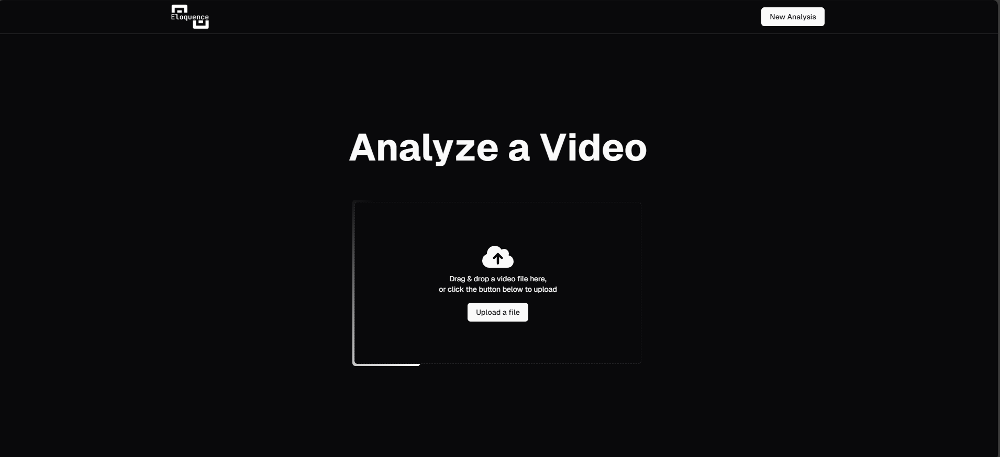
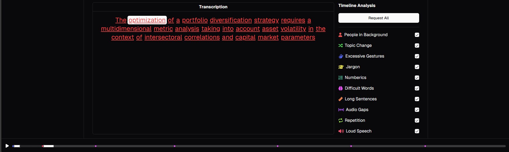

# Speaklytics Frontend

Welcome to the frontend repository of Speaklytics, a web-based platform designed to provide insightful analytics about your own speeches. This repository contains the user interface built with Angular, which interacts with the [Speaklytics backend](https://github.com/Speaklitycs/Speaklytics---backend).


## Installation

1. **Clone the Repository**:

   ```bash
   git clone https://github.com/Speaklitycs/Speaklytics---frontend.git
   cd Speaklytics---frontend
   ```

2. **Install Dependencies**:

   ```bash
   npm install
   ```


## Running the Application

To start the development server on port 4200:

```bash
npm run dev
```

The application will be accessible at `http://localhost:8080/new`.
If you want to access full functionality, remember to run the backend as well!

## UI Screenshots

### Dashboard


### Speech Analysis


## Contributing

We welcome contributions! Please fork the repository and submit a pull request with your changes. Ensure your code adheres to our coding standards and includes appropriate tests.

## License

This project is licensed under the MIT License. See the [LICENSE](LICENSE) file for details.

